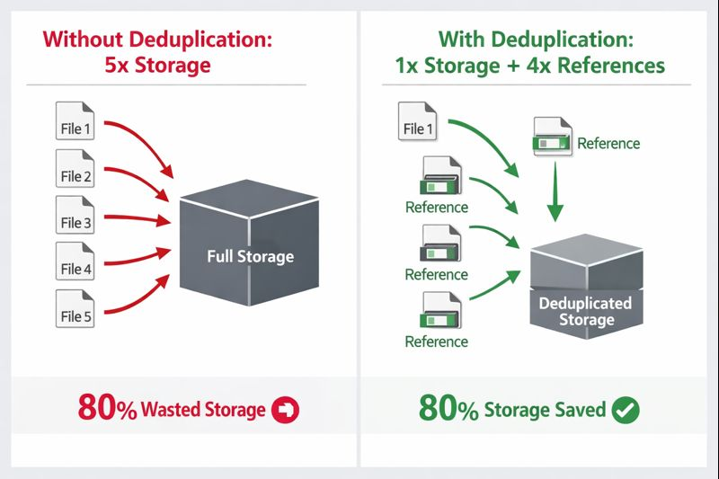
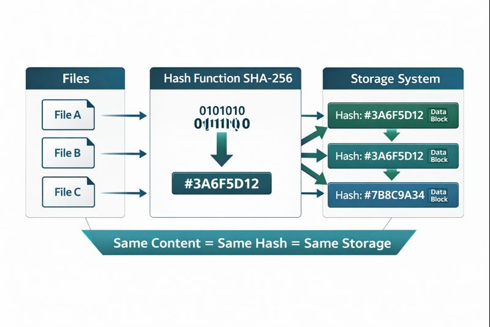
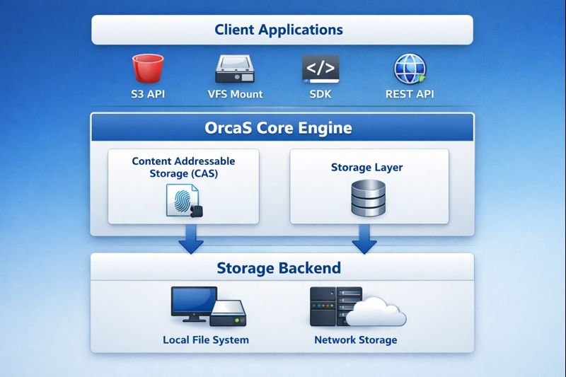
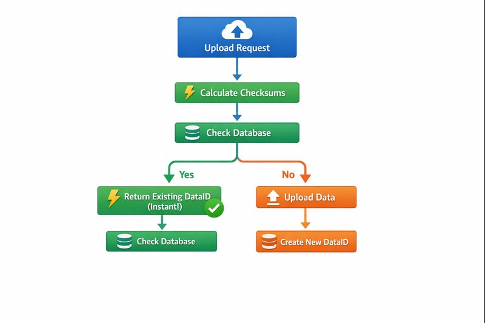

<p align="center">
  <a href="https://orcastor.github.io/doc/">
    
  </a>
</p>

<p align="center"><strong>OrcaS: Open Ready-to-Use Content Addressable Storage</strong></p>

<p align="center">
  <a href="/go.mod#L3" alt="go version">
    
  </a>
  <a href="https://goreportcard.com/badge/github.com/orcastor/orcas" alt="goreport">
    
  </a>
  <a href="https://app.fossa.com/projects/git%2Bgithub.com%2Forcastor%2Forcas?ref=badge_shield" alt="FOSSA Status">
    
  </a>
  <a href='https://orca-zhang.semaphoreci.com/branches/733643c4-54d7-4cc4-9b1e-c3c77c8ff7db' alt='Build Status'>
    
  </a>
  <a href="https://github.com/orcastor/orcas/blob/master/LICENSE" alt='MIT license'>
    
  </a>
  <a href="https://orcastor.github.io/doc/" alt='docs'>
    
  </a>
</p>

- [English](README.md) | [中文](README.zh.md)

## 🚀 What is OrcaS?

**OrcaS** (Open Ready-to-Use Content Addressable Storage) is a **lightweight, high-performance object storage system** built with **Content Addressable Storage (CAS)** at its core. It provides enterprise-grade features like instant deduplication, multi-versioning, zero-knowledge encryption, and smart compression - all in a single binary that's ready to deploy.

### Why OrcaS?

- 🌐 **Open**: Open source (MIT license), transparent, community-driven development
- ✅ **Ready-to-Use**: Content Addressable Storage ensures data integrity and automatic deduplication, production-ready out of the box
- 🎯 **Content Addressable Storage**: Data is stored by content hash, enabling automatic deduplication and integrity verification
- ⚡ **Instant Upload (Deduplication)**: Upload files in seconds, not minutes - identical files are detected instantly without uploading
- 🔒 **Zero-Knowledge Encryption**: Your data, your keys - end-to-end encryption with industry-standard algorithms
- 📦 **Production Ready**: S3-compatible API, VFS mount support, and comprehensive documentation
- 🚀 **High Performance**: Optimized for both small and large files with intelligent packaging and chunking

## ✨ Key Features

### ⏱ Instant Upload (Object-level Deduplication)

**What it does**: Upload identical files instantly without transferring data.

**How it works**: 
- Calculates multiple checksums (XXH3, SHA-256) for each file
- Before uploading, checks if identical content already exists
- If found, creates a reference to existing data instead of uploading
- **Result**: Upload time drops from minutes to milliseconds for duplicate files

**Use cases**:
- Backup systems (same files across multiple backups)
- Version control systems (similar files across versions)
- Multi-user environments (shared files)
- CDN edge storage (cached content)

**Benefits**:
- 🚀 **99%+ faster** uploads for duplicate files
- 💾 **Massive storage savings** - store 1 copy, reference it N times
- ⚡ **Bandwidth savings** - no redundant data transfer
- 🔍 **Automatic integrity verification** - content hash ensures data correctness



### 📦 Small Object Packaging

**What it does**: Efficiently stores many small files together.

**How it works**:
- Groups small files (< 64KB) into packages
- Reduces metadata overhead and I/O operations
- Maintains individual file access while optimizing storage

**Benefits**:
- 📈 **10x+ performance improvement** for small file operations
- 💰 **Reduced storage costs** - less metadata overhead
- ⚡ **Faster operations** - batch metadata writes

### 🔪 Large Object Chunking

**What it does**: Splits large files into manageable chunks.

**How it works**:
- Automatically chunks files larger than configured threshold (default 10MB)
- Each chunk stored independently with its own checksum
- Enables parallel upload/download and efficient updates

**Benefits**:
- 🔄 **Parallel processing** - upload/download chunks concurrently
- 🛡️ **Resumable transfers** - retry failed chunks independently
- ✏️ **Efficient updates** - only modified chunks need re-upload
- 📊 **Better resource utilization** - process large files efficiently

### 🗂 Object Multi-versioning

**What it does**: Automatically maintains file version history.

**How it works**:
- Each file modification creates a new version
- Old versions preserved automatically
- Configurable retention policies
- Space-efficient through content deduplication

**Benefits**:
- 🔙 **Point-in-time recovery** - restore any previous version
- 🛡️ **Data protection** - accidental deletions are recoverable
- 📚 **Audit trail** - track all changes over time
- 💾 **Space efficient** - unchanged data shared across versions

### 🔐 Zero-Knowledge Encryption

**What it does**: End-to-end encryption where only you hold the keys.

**How it works**:
- AES-256 encryption (industry standard)
- Encryption keys never leave your control
- Optional per-bucket encryption keys
- Transparent encryption/decryption

**Benefits**:
- 🔒 **Maximum security** - even storage admins can't read your data
- ✅ **Compliance ready** - meets strict security requirements
- 🛡️ **Data privacy** - your data, your control
- 🌍 **International standards** - AES-256 encryption

### 🗜 Smart Compression

**What it does**: Automatically compresses data to save space.

**How it works**:
- Configurable compression algorithms (zstd, gzip, etc.)
- Compression applied before encryption
- Automatic detection of already-compressed data
- Per-bucket compression settings

**Benefits**:
- 💾 **Storage savings** - typically 30-70% reduction
- ⚡ **Bandwidth savings** - less data to transfer
- 🎯 **Smart defaults** - works out of the box
- ⚙️ **Configurable** - adjust per your needs

## 🏗️ Architecture & Design

### Content Addressable Storage (CAS) Core

OrcaS is built on **Content Addressable Storage** principles, where data is stored and retrieved by its content hash rather than location.



**Key Benefits of CAS**:
1. **Automatic Deduplication**: Identical content stored once, referenced many times
2. **Integrity Verification**: Content hash ensures data hasn't been corrupted
3. **Efficient Versioning**: New versions only store changed content
4. **Simplified Backup**: Same content = same hash = no re-upload needed

### System Architecture



### Instant Upload Flow



### Data Storage Structure

```
Storage Layout:
├── Metadata (SQLite)
│   ├── Objects (files, directories)
│   ├── DataInfo (content metadata)
│   ├── Versions (version history)
│   └── References (deduplication)
│
└── Data Blocks (File System)
    └── <bucket_id>/
        └── <hash_prefix>/
            └── <hash>/
                └── <dataID>_<chunk_number>
```

## 📊 Performance Highlights

- **Instant Upload**: 99%+ faster for duplicate files (milliseconds vs minutes)
- **Small Files**: 10x+ performance improvement with packaging
- **Large Files**: Parallel chunk processing for optimal throughput
- **Storage Efficiency**: 30-70% space savings with compression + deduplication
- **Concurrent Operations**: Optimized for high concurrency

**Performance Test Reports**:
- [S3 API Performance Test Report](s3/docs/PERFORMANCE_TEST_REPORT.md)
- [VFS Performance Optimization Report](vfs/PERFORMANCE_OPTIMIZATION_FINAL.md)

## 🔧 Path Management

OrcaS supports flexible path management, allowing you to use different storage paths within the same process. This is useful for multi-tenant scenarios or when managing multiple storage locations.

### Environment Variables (Global Defaults)

```bash
export ORCAS_BASE=/var/orcas/base  # Base path for metadata (main database)
export ORCAS_DATA=/var/orcas/data  # Data path for file data storage
```

### Context-Based Path Configuration

You can override global paths per context, enabling multiple storage locations in the same process:

```go
import (
    "context"
    "github.com/orcastor/orcas/core"
)

// Method 1: Direct path setting
ctx := context.Background()
ctx = core.Path2Ctx(ctx, "/path/to/base", "/path/to/data")

// Method 2: Using Config struct
cfg := &core.Config{
    BasePath: "/custom/base/path",
    DataPath: "/custom/data/path",
    // ... other config options
}
ctx = core.Config2Ctx(ctx, cfg)

// All operations using this context will use the specified paths
handler := core.NewLocalHandler()
dataID, err := handler.PutData(ctx, bktID, 0, -1, data)
```

### Benefits

- 🔄 **Multi-tenant Support**: Different contexts can use different storage paths
- 🎯 **Flexible Configuration**: Override paths per operation without changing global settings
- ⚙️ **Backward Compatible**: Falls back to global `ORCAS_BASE` and `ORCAS_DATA` if not set in context
- 🚀 **Process Isolation**: Multiple storage locations in the same process

## 📚 Documentation

- [Full Documentation](https://orcastor.github.io/doc/)
- [VFS Mount Guide](vfs/MOUNT_GUIDE.md) - Complete guide for VFS filesystem mounting
- [S3 API Documentation](s3/README.md)
- [No Main Database Mode Guide](docs/NO_BASE_DB_GUIDE.md) - Run without main database (no user management)

## 🤝 Contributing

Contributions are welcome! Please feel free to submit a Pull Request.

## 📄 License

MIT License - see [LICENSE](LICENSE) file for details.

## ⭐ Why Star This Project?

- 🎯 **Production Ready**: Battle-tested, actively maintained
- 🚀 **High Performance**: Optimized for real-world workloads
- 🔒 **Security First**: Zero-knowledge encryption built-in
- 💾 **Storage Efficient**: Automatic deduplication saves space and costs
- 🛠️ **Easy to Use**: S3-compatible API, VFS mount, comprehensive docs
- 🌟 **Innovative**: Content Addressable Storage with instant deduplication
- 📈 **Actively Developed**: Regular updates and improvements
- 🤝 **Open Source**: MIT licensed, community-driven

**Star us if you find this project useful!** ⭐

---

[](https://app.fossa.com/projects/git%2Bgithub.com%2Forcastor%2Forcas?ref=badge_large)
